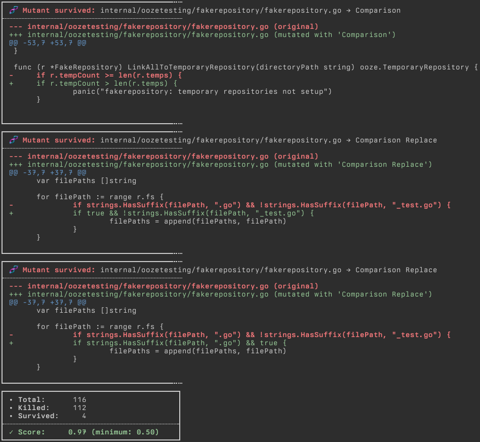

<h1 align="center">
<a href="https://github.com/gtramontina/ooze">
	
</a>
</h1>

<p align="center">
	<a href="https://pkg.go.dev/github.com/gtramontina/ooze"></a>
	<a href="https://github.com/gtramontina/ooze/actions/workflows/ci.yml"></a>
	<a href="https://github.com/gtramontina/ooze/actions/workflows/mutation.yml"></a>
</p>

## Mutation Testing?

Mutation testing is a technique used to assess the quality and coverage of test suites. It involves introducing controlled changes to the code base, simulating common programming mistakes. These changes are, then, put to test against the test suites. A failing test suite is a good sign. It indicates that the tests are identifying mutations in the code—it "killed the mutant". If all tests pass, we have a surviving mutant. This highlights an area with weak coverage. It is an opportunity for improvement.

There are different types of changes that mutation tests can perform. A common collection usually include:

* Changing an operator;
* Replacing a constant;
* Removing a statement;
* Increasing/decreasing numbers;
* Flipping booleans;

Mutations can also be domain/application-specific. Although, these are up to the maintainers of such application to develop.

It is worth mentioning that mutation tests can be quite expensive to run. Especially on larger code bases. And the reason is that for every mutation, on every source file, the entire suite of tests has to run. One can look at the bright side of this and think as an incentive to keep the test suites fast.

Mutation testing is a great ally in developing a robust code base and a reliable set of test suites.

## Quick Start

### Prerequisites

In order to ensure that you get accurate results, make sure that test suite that Ooze will run is passing. Otherwise, Ooze will report as if all mutants have been killed.

When Ooze reports that it found a living mutant, it will print a diff of the changes the virus made to the source file. The mutant source is printed using Go's [`go/format`](https://pkg.go.dev/go/format) package. This means that, if your source code isn't gofmt'd, the diff may contain some formatting changes that are not relevant to the mutation. This isn't a prerequisite per se, but for a better experience, it is recommended that you run `gofmt` on your source files.

### Installation

1. Install ooze:

	```shell
	go get github.com/gtramontina/ooze
	```

	This pulls the latest version of Ooze and updates your `go.mod` and `go.sum` to reference this new dependency.

2. Create a `mutation_test.go` file in the root of your repository and add the following:

	```go
	//go:build mutation

	package main_test

	import (
		"testing"

		"github.com/gtramontina/ooze"
	)

	func TestMutation(t *testing.T) {
		ooze.Release(t)
	}
	```

	The build tag is so you can better control _when_ to run these tests (see the next step). This is a test as you'd write any other Go test. What differs is what the test actually does. And this is where it delegates to Ooze, by `Release`ing it.

3. Run with:

	```shell
	go test -v -tags=mutation
	```

	This will execute all tests in the current package including the sources tagged with `mutation`. This assumes that the above is the only test file in the root of your project. If you have other tests, you may want to put the mutation tests in a separate package, under `./mutation` for example, and configure Ooze to use `..` as the repository root (see [`WithRepositoryRoot`](#Settings) below).

	If `-v` is enabled, Ooze will also be verbose. To enable Ooze's verbose mode only without the test framework verbosity, use `-ooze.v`.

	> **Note**
	> printing to `stdout` while Go tests are running has its intricacies. Running the tests at a particular package (without specifying which test file or subpackages, like `./...`), allows for Ooze to print progress and reports as they happen. Otherwise, the output is buffered and printed at the end of the test run and, in some cases, only if a test fails. This is a limitation of Go's testing framework.

### Results

Once all tests on all mutants have run, Ooze will print a report with the results. It will also exit with a non-zero exit code if the mutation score is below the minimum threshold (see [`WithMinimumThreshold`](#Settings) below). This is an example of the report:



More examples of the results can be found in the [`mutation.yml`](https://github.com/gtramontina/ooze/actions/workflows/mutation.yml) workflow.

## Settings

Ooze's [`Release`](release.go) method takes variadic [`Options`](options.go), like so:

```go
ooze.Release(
	t,
	ooze.WithRepositoryRoot("."),
	ooze.WithTestCommand("make test"),
	ooze.WithMinimumThreshold(0.75),
	ooze.Parallel(),
	ooze.IgnoreSourceFiles("^release\\.go$"),
)
```

The table below presents all available options.

| Option                 | Default                               | Description                                                                                                                                                                                                                                                                   |
|------------------------|---------------------------------------|-------------------------------------------------------------------------------------------------------------------------------------------------------------------------------------------------------------------------------------------------------------------------------|
| `WithRepositoryRoot`   | `.`                                   | A string that configures which directory is the repository root. This is usually required when your mutation test file lives some other place that is not root itself.                                                                                                        |
| `WithTestCommand`      | `go test -count=1 ./...`              | The test command to run, as string. You may configure it as you wish, as a `makefile` phony target, for example. Or simply run the standard `go test` command with extra flags, such as `timeout` and `tags`.                                                                 |
| `WithMinimumThreshold` | `1.0`                                 | A float between `0.0` and `1.0`. This represents the minimum mutation test score to consider the execution successful.                                                                                                                                                        |
| `Parallel`             | `false`                               | Indicates whether to run the tests on the mutants in parallel. Given Ooze is executed via Go's testing framework, the level of parallelism can be configured when running the mutation tests from the command line. For example with `go test -v -tags=mutation -parallel 3`. |
| `IgnoreSourceFiles`    | `nil`                                 | Regular expression representing source files to be filtered out and not suffer any mutations.                                                                                                                                                                                 |
| `WithViruses`          | all available ([see below](#Viruses)) | A list of viruses to infect the source files with. You can also implement your own viruses (generic or even application-specific).                                                                                                                                            |
| `ForceColors`          | `false`                               | Forces colors in logs. This is useful when running the mutation tests in a CI environment, for example.                                                                                                                                                                       |

## Viruses

| Virus                                                                                            | Name                         | Description                                                                                                                                                                                                                     |
|--------------------------------------------------------------------------------------------------|------------------------------|---------------------------------------------------------------------------------------------------------------------------------------------------------------------------------------------------------------------------------|
| [`arithmetic`](viruses/arithmetic/arithmetic.go)                                                 | Arithmetic                   | Replaces `+` with `-`, `*` with `/`, `%` with `*` and vice versa.                                                                                                                                                               |
| [`arithmeticassignment`](viruses/arithmeticassignment/arithmeticassignment.go)                   | Arithmetic Assignment        | Replaces `+=`, `-=`, `*=`, `/=`, `%=`, `&=`, <code>&#124;=</code>, `^=`, `<<=`, `>>=` and `&^=` with `=`.                                                                                                                       |
| [`arithmeticassignmentinvert`](viruses/arithmeticassignmentinvert/arithmeticassignmentinvert.go) | Arithmetic Assignment Invert | Replaces `+=` with `-=`, `*=` with `/=`, `%=` with `*=` and vice versa.                                                                                                                                                         |
| [`bitwise`](viruses/bitwise/bitwise.go)                                                          | Bitwise                      | Replaces `&` with <code>&#124;</code>, <code>&#124;</code> with `&`, `^` with `&`, `&^` with `&`, `<<` with `>>` and `>>` with `<<`.                                                                                            |
| [`cancelnil`](viruses/cancelnil/cancelnil.go)                                                    | Cancel Nil                   | Changes calls to [`context.CancelCauseFunc`](https://pkg.go.dev/context#CancelCauseFunc) to pass nil.                                                                                                                           |
| [`comparison`](viruses/comparison/comparison.go)                                                 | Comparison                   | Replaces `<` with `<=`, `>` with `>=` and vice versa.                                                                                                                                                                           |
| [`comparisoninvert`](viruses/comparisoninvert/comparisoninvert.go)                               | Comparison Invert            | Replaces `>` with `<=`, `<` with `>=`, `==` with `!=` and vice versa.                                                                                                                                                           |
| [`comparisonreplace`](viruses/comparisonreplace/comparisonreplace.go)                            | Comparison Replace           | Replaces the left and right sides of an `&&` comparison with `true` and the left and right sides of an <code>&#124;&#124;</code> with false. E.g. `1 == 1 && 2 == 2` gets two mutations: `true && 2 == 2` and `1 == 1 && true`. |
| [`floatdecrement`](viruses/floatdecrement/floatdecrement.go)                                     | Float Decrement              | Decrements floating points by `1.0`.                                                                                                                                                                                            |
| [`floatincrement`](viruses/floatincrement/floatincrement.go)                                     | Float Increment              | Increments floating points by `1.0`.                                                                                                                                                                                            |
| [`integerdecrement`](viruses/integerdecrement/integerdecrement.go)                               | Integer Decrement            | Decrements integers by `1`.                                                                                                                                                                                                     |
| [`integerincrement`](viruses/integerincrement/integerincrement.go)                               | Integer Increment            | Increments integers by `1`.                                                                                                                                                                                                     |
| [`loopbreak`](viruses/loopbreak/loopbreak.go)                                                    | Loop Break                   | Replaces loop `break` with `continue` and vice versa.                                                                                                                                                                           |
| [`loopcondition`](viruses/loopcondition/loopcondition.go)                                        | Loop Condition               | Replaces loop condition with an always false value.                                                                                                                                                                             |
| [`rangebreak`](viruses/rangebreak/rangebreak.go)                                                 | Range Break                  | Adds an early break to `range`s.                                                                                                                                                                                                |

### Custom viruses

Ooze's viruses follow the [`viruses.Virus`](viruses/virus.go) interface. All it takes to write a new virus is to have a struct that implements this interface. To get this new virus running, let Ooze know about it by running `Release` with the `WithViruses(…)` option. In order to test it, you may want to use the [oozetesting](oozetesting) package to help out. Take a look at the existing [viruses](viruses) to have an idea.

If your new virus is domain-agnostic, and you find it useful, consider contributing it to this project. You can also write domain-specific viruses. One that looks for a particular struct type and change it in a particular way, for example.

## Tips

1. Ooze runs your test suite for every mutant it creates. Having a fast suite is a good idea. The way Ooze detects that a mutant was killed is by having a failing test. The quicker your suite catches the faster the mutation testing will finish. Go testing framework allows for us to flag it to fail fast with `-failfast`. Although this is better than nothing, this doesn't work across packages (see this [issue](https://github.com/golang/go/issues/33038) for more details). This is where [gotestsum](https://github.com/gotestyourself/gotestsum) comes in. It allows us to fail even faster by configuring it with `--max-fails=1`.
2. Mutation testing usually takes a significant amount of time to run. Especially if you have a large codebase. It may be a good approach to run it on a separate path on your CI pipeline; preferably after you get confirmation that your test suite is passing. This way you can get the results of the mutation testing without slowing down your main pipeline.
3. Ooze runs itself. I recommend exploring this codebase to get a better idea of how to use it.

## Prior Art

Ooze is heavily inspired by [go-mutesting](https://github.com/zimmski/go-mutesting), by [@zimmski](https://github.com/zimmski), and by extra mutations added to a [fork](https://github.com/avito-tech/go-mutesting) by [@avito-tech](https://github.com/avito-tech).

You can find more resources and tools on this subject by browsing through the [mutation testing](https://github.com/topics/mutation-testing) topic on GitHub. The [awesome-mutation-testing](https://github.com/theofidry/awesome-mutation-testing) repository also contains many good resources.

## License

Ooze is open-source software released under the [MIT License](LICENSE).

---

<a href="https://github.com/gtramontina/ooze">
	
</a>
